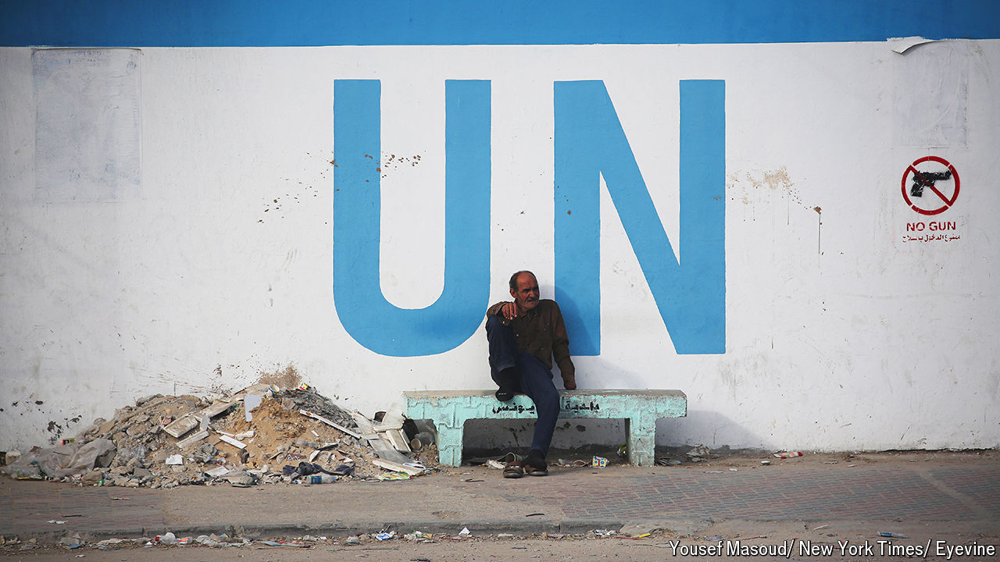

###### UNintended consequences

# A UN vote on Palestine underlines America’s weakening clout 

##### Russia and China are riding a surge of support for the Palestinians since the Gaza war started 

 

> Sep 18th 2024 

“THE RUSSIANS are not the bad guys any more. Now it’s the Americans.” Thus, explains a European diplomat at the UN, the war in Gaza is eclipsing the one in Ukraine. These days many countries are wary of criticising Russia’s aggression. Instead their outrage is directed at Israel and, increasingly, at America for arming and protecting the Jewish state. The accusation of Western double standards, gleefully amplified by Russia and China, resonated across the halls of UN headquarters on September 18th as the General Assembly adopted a far-reaching resolution to exert pressure on Israel to end its occupation of Palestinian territories within a year. It passed with an overwhelming 124 votes in favour to 14 against (and 43 abstentions).

