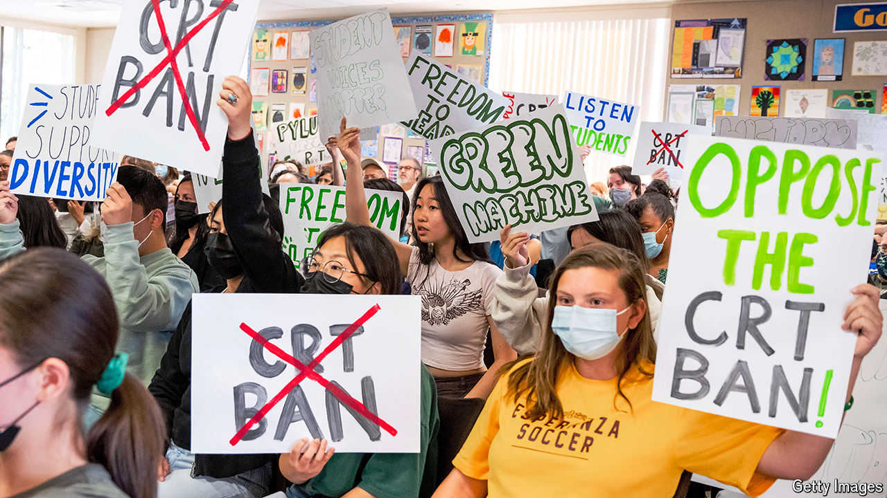

###### The left’s doctrine of original sin

# After peak woke, what next? 

##### The influence of a set of illiberal ideas is waning. That creates an opportunity 

 

> Sep 19th 2024 

ONE OF THE early uses of the word was by Lead Belly, who sang about the Scottsboro boys, nine young African-Americans in Scottsboro, Alabama, who were wrongly accused in 1931 of raping two white women. They got an unfair trial; all nine later had their convictions overturned or were pardoned. In a recording in 1938, Lead Belly warns black Americans travelling through Alabama to stay “woke”, lest they be accused of something similar. Even the most committed anti-woke warrior would grant that the man had a point.

