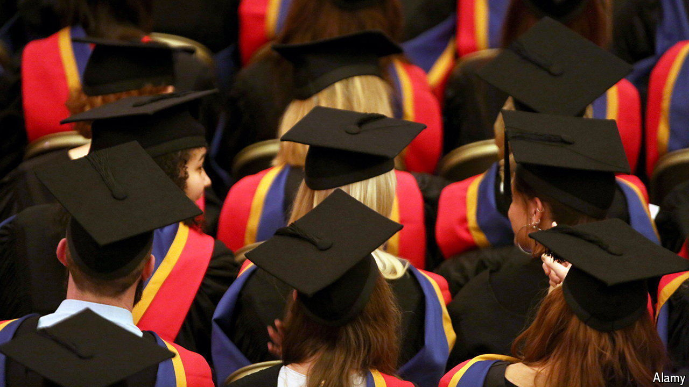

###### Painful lessons

# Britain should let university tuition fees rise 

##### Domestic students have been paying less in real terms every year 

 

> Sep 18th 2024 

In 2012 politicians in Britain burned lots of political capital by raising the cap on how much English universities can charge domestic undergraduates in tuition fees. Sir Nick Clegg, the deputy prime minister at the time, had previously pledged not to raise fees and never lived down the U-turn. This political folk memory helps explain why the Labour Party, which took power in July and has campaigned in the past to abolish tuition fees, will find it difficult to raise the cap again. That is nonetheless what it should do.

