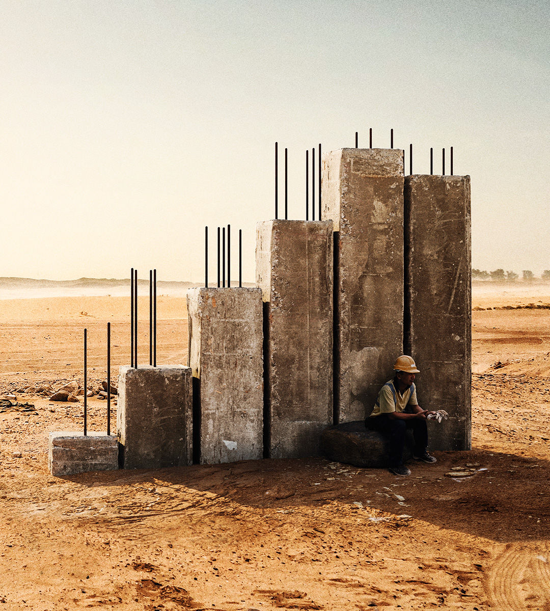

###### Held back

# How the world’s poor stopped catching up 

##### Progress stalled around 2015. To restart it, liberalise 

 

> Sep 19th 2024 

SINCE THE Industrial Revolution, rich countries have mostly grown faster than poor ones. The two decades after around 1995 were an astonishing exception. During this period gaps in GDP narrowed, extreme poverty plummeted and global public health and education improved vastly, with a big fall in malaria deaths and infant mortality and a rise in school enrolment. Globalisation’s critics will tell you that capitalism’s excesses and the global financial crisis should define this era. They are wrong. It was defined by its miracles.

