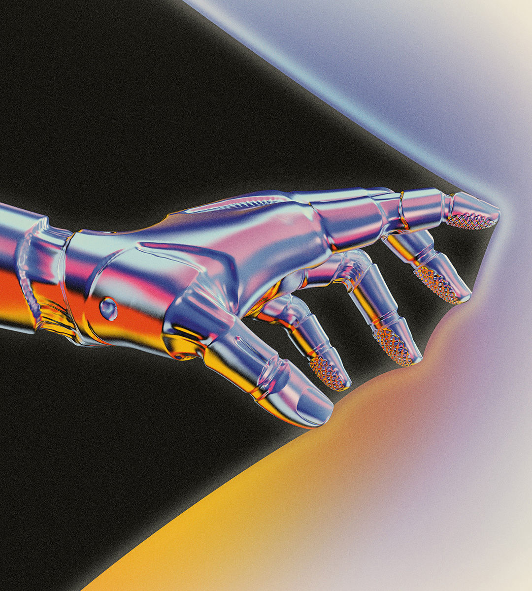

###### Power, chips and constraints

# The breakthrough AI needs 

##### A race is on to push artificial intelligence beyond today’s limits 

 

> Sep 19th 2024 

Two years after Chatgpt took the world by storm, generative artificial intelligence seems to have hit a roadblock. The energy costs of building and using bigger models are spiralling, and breakthroughs are getting harder. Fortunately, researchers and entrepreneurs are racing for ways around the constraints. Their ingenuity will not just transform ai. It will determine which firms prevail, whether investors win, and which country holds sway over the technology. 

