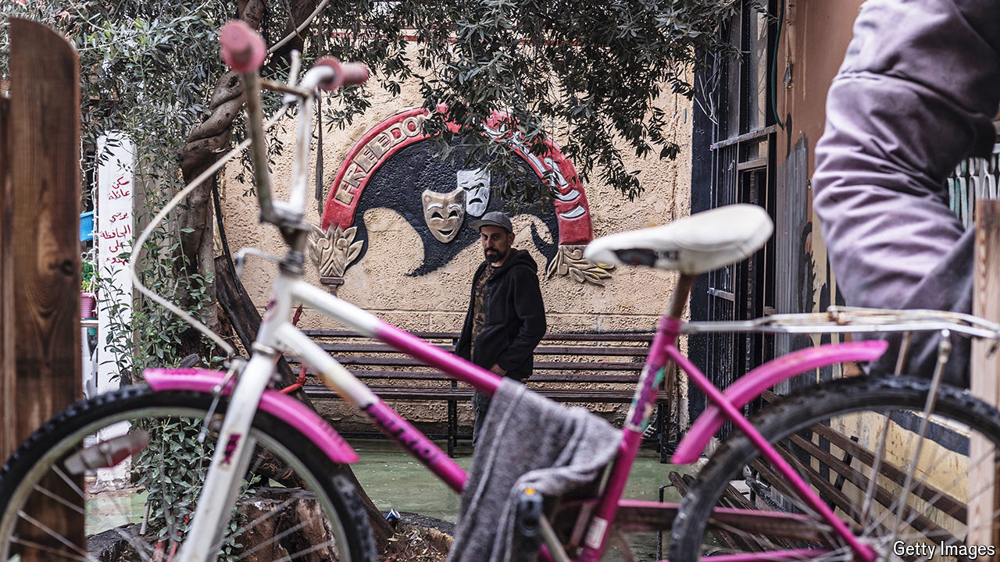

###### Staging protests

# A theatre in Jenin offers a different kind of Palestinian resistance 

##### It is a target for both Israel and Palestinian militants 

 

> Sep 19th 2024 

The existence of a theatre in the middle of any refugee camp would be unusual. But in Jenin, in the occupied West Bank, it is particularly striking. The camp and its adjacent city have long been a symbol of deadly terror for Israelis and fierce—often violent—resistance for Palestinians. And yet the Freedom Theatre has become the symbol of a different kind of Palestinian struggle.

