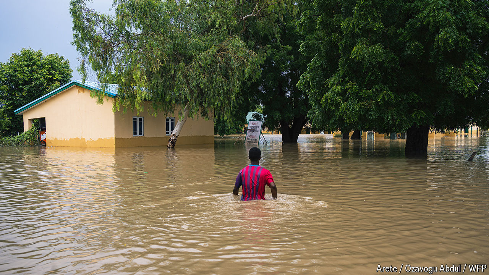

###### A perfect storm

# Floods in Nigeria’s north-east are aggravating a humanitarian crisis 

##### The region had already been devastated by the Boko Haram insurgency 

 

> Sep 19th 2024 

The ambulance rolled into the main teaching hospital in Maiduguri, the capital of Borno state in north-east Nigeria. Through the open back door two limp, swollen legs were visible. Skin that was once brown was ashen and wrinkled. The body had the telltale signs of drowning. Medics took it to the mortuary, one of the few parts of the hospital still functioning.

