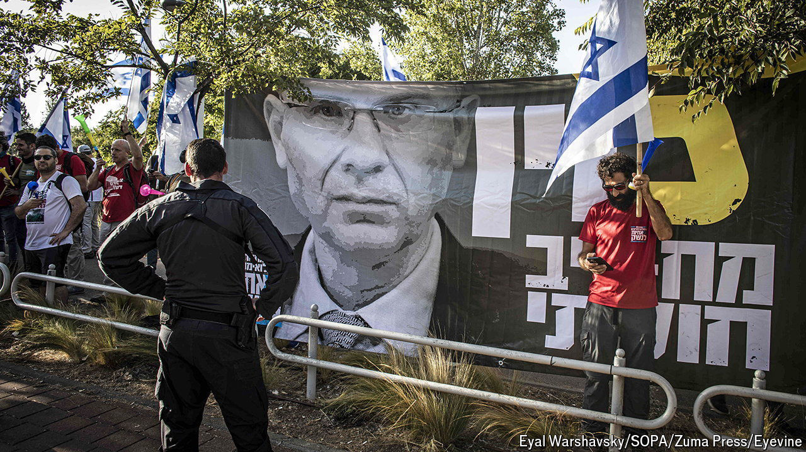

###### Politicians v judges

# Israel’s government is again trying to hobble its Supreme Court 

##### While at war, Israel is facing a constitutional crisis 

 

> Sep 19th 2024 

For nearly a year Israel’s Supreme Court has been without a president, as the country’s right-wing government has tussled with the judiciary over the court’s powers. As soon as it was elected at the end of 2022, the government of Binyamin Netanyahu presented plans for “judicial reforms” which would limit the powers of the Supreme Court and give politicians control of the appointment of judges. The proposals prompted huge protests and were abandoned when the war in Gaza began. But they are back on the agenda. 

