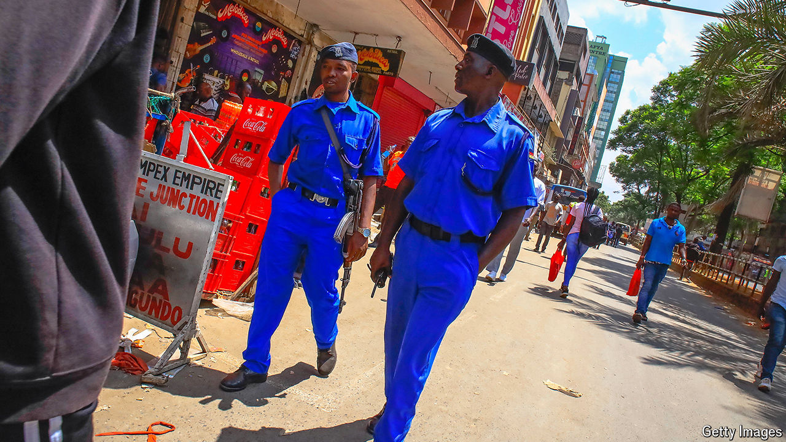

###### Daylight robbery

# Nairobi’s reputation for crime is outdated 

##### That is only in part thanks to its notorious police 

 

> Sep 19th 2024 

There is an era in the history of many cities that is inextricably linked, in the public imagination, to crime and lawlessness—think 1920s Chicago or 1980s New York. For Nairobi that period is the 1990s. In the old business district, carjackings were a daily occurrence, remembers Farida Ali, a shop-owner there. Violent crime was so common that residents dubbed the Kenyan capital “Nairobbery”. 

