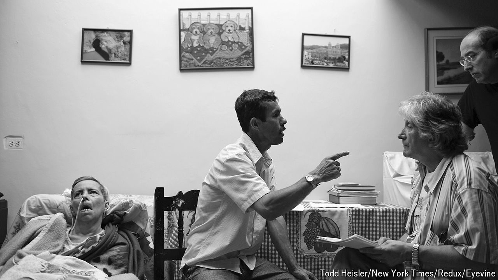

###### The land of forgetting

# Francisco Lopera’s travels in the Andes began to solve a great mystery 

##### The Colombian neurologist and Alzheimer’s researcher died on September 10th, aged 73 

 

> Sep 18th 2024 

His father’s tears persuaded him. Francisco Lopera, then in his first year of medical training, had gone with him to see his grandmother in Medellín. His father had not wanted him to study medicine; he thought he was not intelligent enough. But that was not why he wept. He wept because the old lady, in the last stages of Alzheimer’s, stared blankly at them, not knowing who they were. Then and there, Francisco made a vow: when he became a doctor, that was not going to happen to any granny. 

