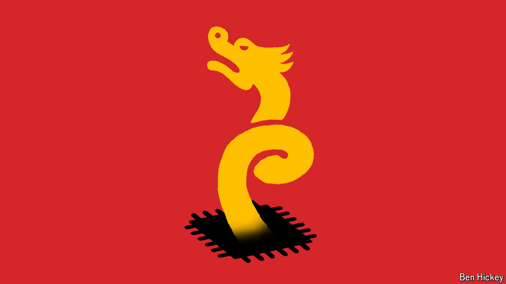

###### The mother of invention

# China’s AI firms are cleverly innovating around chip bans 

##### Tweaks to software blunt the shortage of powerful hardware 

 

> Sep 19th 2024 

TODAY’S TOP artificial-intelligence (AI) models rely on large numbers of cutting-edge processors known as graphics processing units (GPUs). Most Western companies have no trouble acquiring them. Llama 3, the newest model from Meta, a social-media giant, was trained on 16,000 H100 GPUs from Nvidia, an American chipmaker. Meta plans to stockpile 600,000 more before year’s end. XAI, a startup backed by Elon Musk, has built a data centre in Memphis powered by 100,000 H100s. And though OpenAI, the other big model-maker, is tight-lipped about its GPU stash, it had its latest processors hand-delivered by Jensen Huang, Nvidia’s boss, in April.

