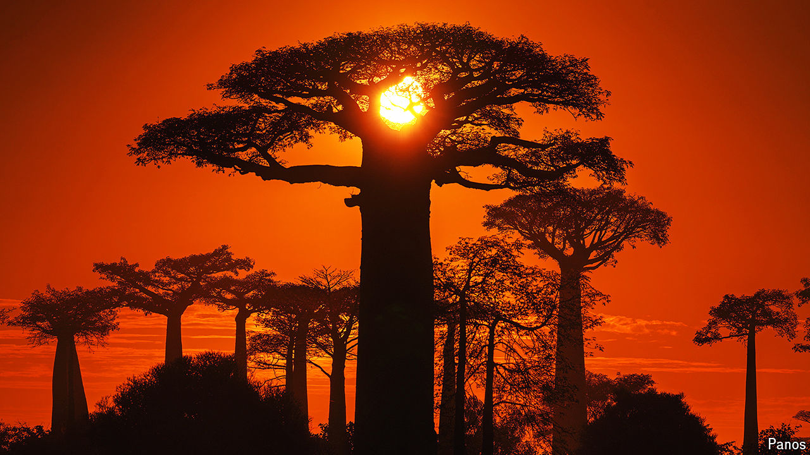

###### Long-standing mystery

# How bush pigs saved Madagascar’s baobabs 

##### Non-native species are not always harmful 

 

> Sep 18th 2024 

THE MALAGASY baobab tree, whose thick trunks and tiny branches dot Madagascar’s landscape, should not, by rights, have survived to the present day. Scientists believe that its large seeds were once dispersed by the giant tortoises and gorilla-size giant lemurs that roamed the island. When these species went extinct over one thousand years ago owing to human activity, the baobab tree should have vanished too. It did not. Seheno Andriantsaralaza at the University of Antananarivo in Madagascar and Onja Razafindratsima at the University of California, Berkeley, now think they may know the reason why.

