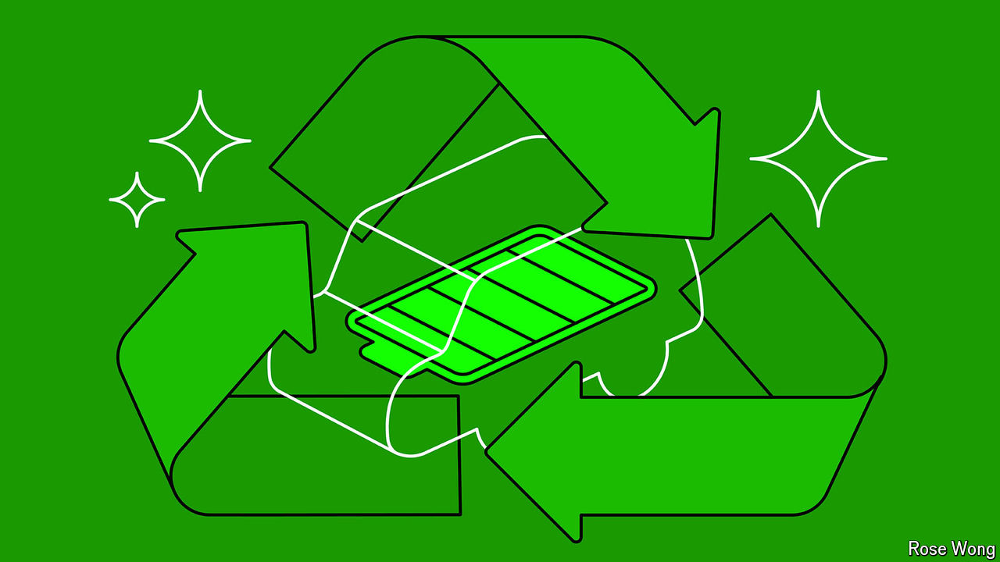

###### Waste not, want not

# Most electric-car batteries could soon be made by recycling old ones 

##### Mining for raw materials may peak by the mid-2030s 

 

> Sep 19th 2024 

Despite a slowdown in electric-vehicle (EV) sales in some countries, demand for batteries was up by around 40% globally last year, and seems likely to continue at a similar pace. Consequently, the world’s appetite for lithium, the vital ingredient in the lithium-ion (Li-ion) batteries that dominate the EV market, is expected to exceed 2.4m tonnes in 2030, more than twice its present level.

