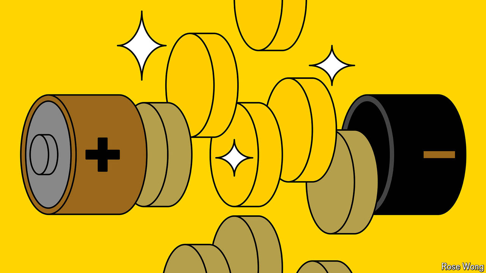

###### Energy storage

# New battery designs could lead to gains in power and capacity 

##### Researchers are looking beyond the cathode 

 

> Sep 19th 2024 

IN THEir QUEST to build a better battery, researchers have blazed a trail through the elements of the periodic table. The earliest prototype cells ran on nickel and cadmium; successors have used everything from zinc and iron to sodium and lead.

