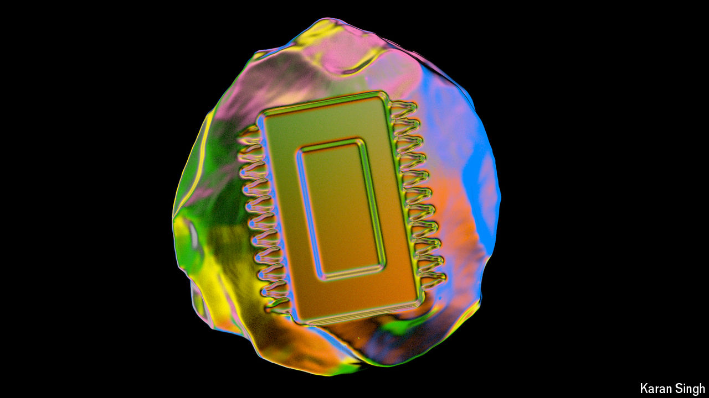

###### A Cambrian moment

# AI has propelled chip architecture towards a tighter bond with software 

##### It has also been pushed farther towards specialisation 

 

> Sep 16th 2024 

Exactly when the process started no one knows, but fossils from the Cambrian period some 540m years ago show life on Earth going through a remarkable period of diversification. The point at which it became clear that a similarly transformational diversification was kicking off in the world of chips can be dated much more precisely. In May 2016, at Google’s annual event for developers, Sundar Pichai, the firm’s boss, casually mentioned that “We have started building specialised custom hardware.” 

