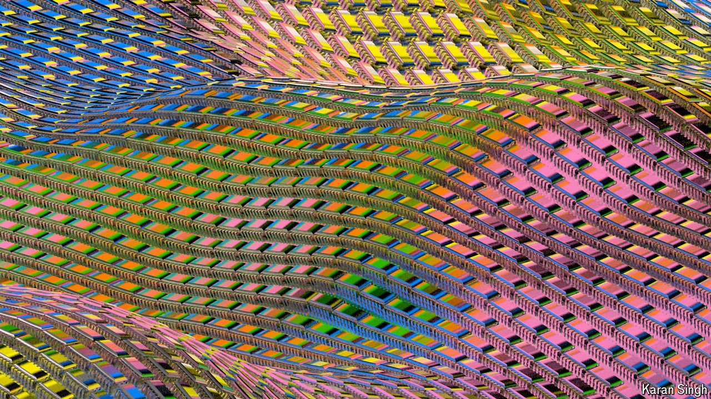

###### Putting the silicon back in the valley

# AI has returned chipmaking to the heart of computer technology 

##### And the technological challenges are bigger than the political ones, argues Shailesh Chitnis 

 

> Sep 16th 2024 

A century ago, 391 San Antonio Road in Mountain View, California, was the site of an apricot-packing shed. Today it is just one of the many low-rise office blocks on busy roads that house Silicon Valley’s tech startups and wannabe billionaires. In front of it, though, stand three large and peculiar sculptures, two-legged and three-legged forms that bring to mind water towers. They are giant versions of two diodes and a transistor, components of electronic circuitry. In 1956, 391 San Antonio Road became the home to the Shockley Semiconductor Laboratory, a startup devoted to the idea of making such components entirely out of silicon. It is the birthplace of Silicon Valley. 

