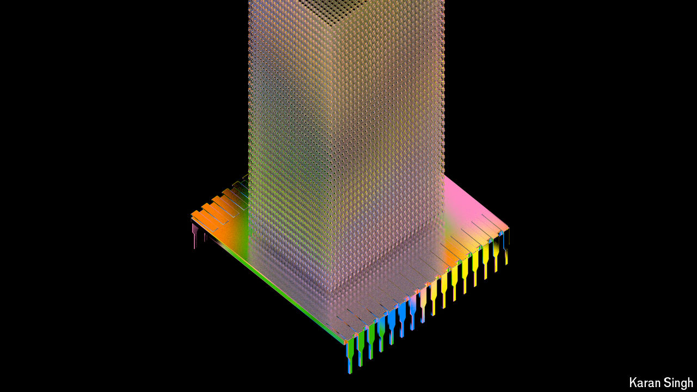

###### Getting to one trillion

# How to build more powerful chips without frying the data centre 

##### Runaway energy consumption remains a problem 

 

> Sep 16th 2024 

The blackwell chip from Nvidia, shovel-maker for the artificial-intelligence (ai) gold rush, contains 208bn transistors spread over two “dies”, pieces of silicon each about 800 square millimetres in area, that house the processor circuitry. The two dies are linked by a blazing 10 terabytes (ie, ten thousand gigabytes) per second chip-to-chip connection. Each die is flanked by four blocks of high-bandwidth memory (hbm) chips that together store 192 gigabytes of data. The advanced packaging methods used to build this megachip are now in the spotlight, with some speculating that they may lead to production delays.

