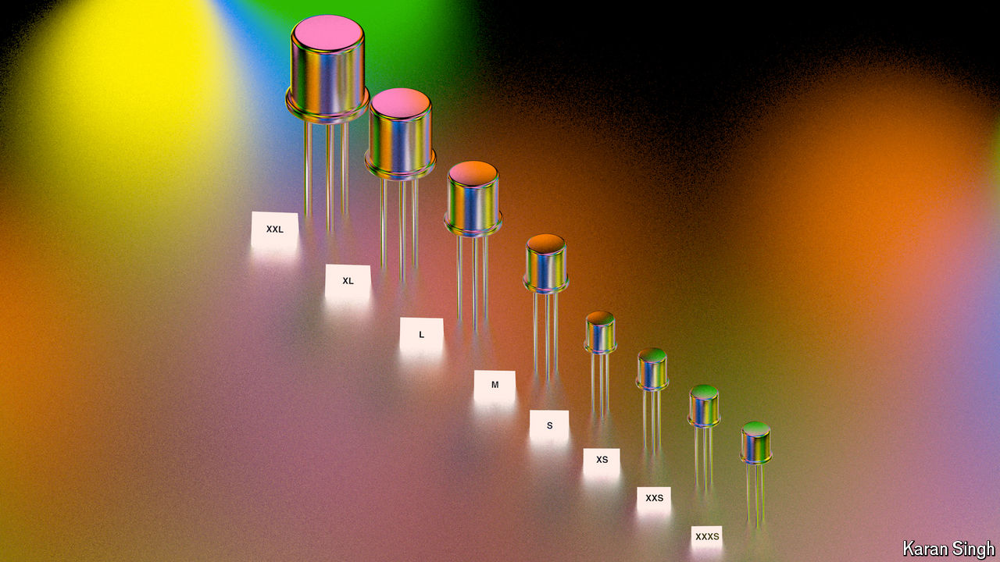

###### The names are meaningless

# Node names do not reflect actual transistor sizes 

##### A favourite way of measuring progress in the chip industry is detached from reality 

 

> Sep 16th 2024 

Pat gelsinger, boss of Intel, a chipmaker, loves to brag that his firm is leading the charge in semiconductor technology by entering the “angstrom era”. The angstrom, named in honour of Anders Jonas Ångström, a 19th-century Swedish physicist, is a somewhat archaic unit equal to a tenth of a nanometre (0.1nm, or a ten billionth of a metre). The “process nodes” of Intel’s latest chips are referred to as “20a” and “18a”. If you take those suffixed As as denoting “angstrom”—which Intel never flat out says that they do—that suggests dimensions of just 2nm or so. And at one point, process node was pretty much synonymous with transistor gate length. 

