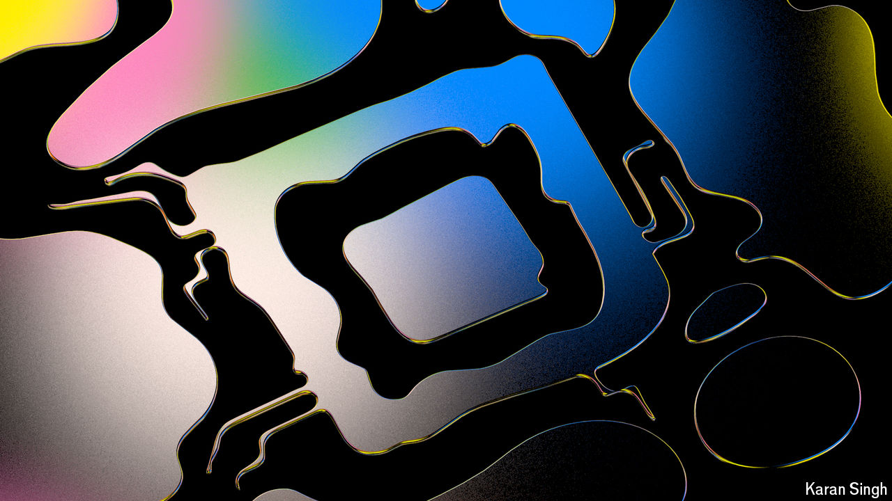

###### OK (analogue) computer

# Researchers are looking beyond digital computing 

##### They are using biology and light to design powerful, energy-efficient chips 

 

> Sep 16th 2024 

In 1945 john von neumann, a Hungarian polymath, proposed an “automatic digital computing system”. His design featured a central processing unit (cpu) for crunching numbers and a memory unit for storing instructions and data, linked by a communication pathway. Von Neumann dreamed of a computer where anything stored in memory would be instantly available to the cpu. In its absence, he came up with a clever fix: a memory hierarchy with small, fast memory close to the cpu and larger, slower memory farther away. Nearly 80 years later, his original blueprint still forms the basis of most modern processors.

