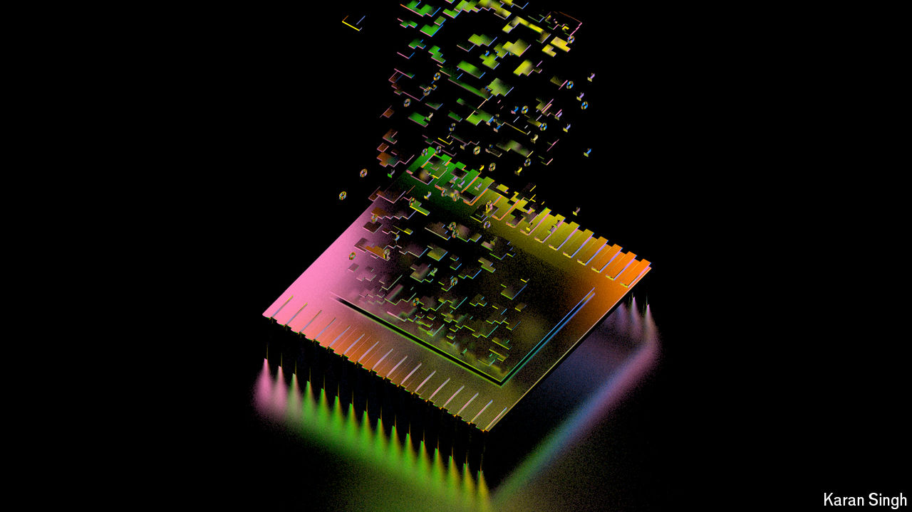

###### The relentless innovation machine

# The end of Moore’s law will not slow the pace of change 

##### Semiconductors are likely to continue their transformational role 

 

> Sep 16th 2024 

The chipmaking industry has always existed in a state of paranoid optimism. Ever since Gordon Moore’s observation that processing power would double roughly every two years was encoded by others into “Moore’s law”, a chorus of experts has been warning of its end. That dread is tinged with a fierce belief that there is always a way to stave off the inevitable. The results have been nothing short of spectacular. In the past 50 years, processors have come to operate tens of thousands of times faster, and store a million times more data in the same area. The cost of a transistor has also fallen by a factor of a billion, making technology a global deflationary force. They are also ubiquitous: semiconductors are now the third-most traded commodity in the world by value, after oil and cars.

