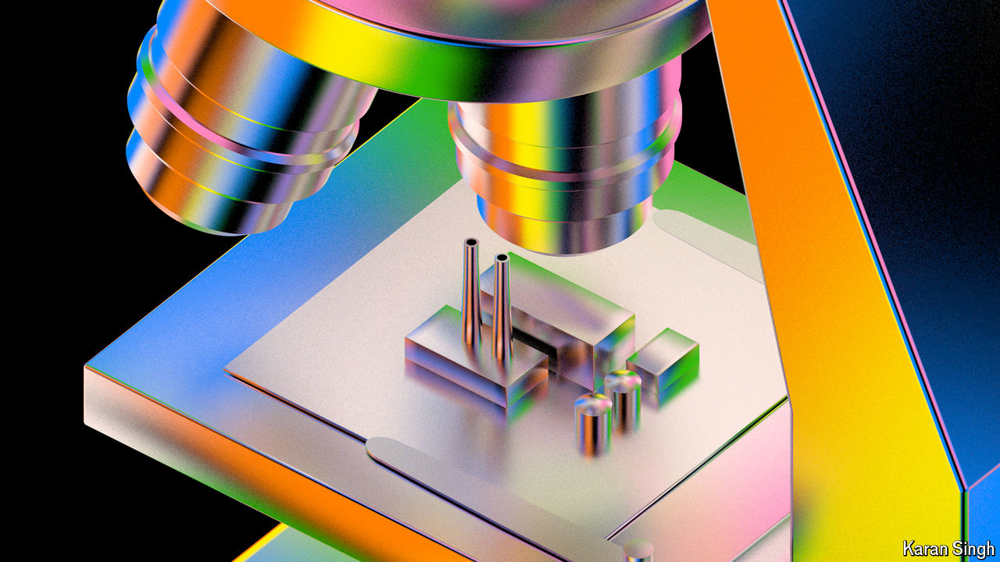

###### Shrink to fit

# The semiconductor industry faces its biggest technical challenge yet 

##### As Moore’s law fades, how can more transistors be fitted onto a chip? 

 

> Sep 16th 2024 

Inside a sterile, cavernous building in the Dutch city of Eindhoven, the latest monster dreamed up by asml, a maker of chipmaking gear, is quietly humming away. Weighing 150 tonnes and the size of a double-decker bus, the tool offers humans the latest way to do something they have been doing since the ice age—writing on stone, otherwise known as lithography. The stone here is silicon; the writing is done with light. 

