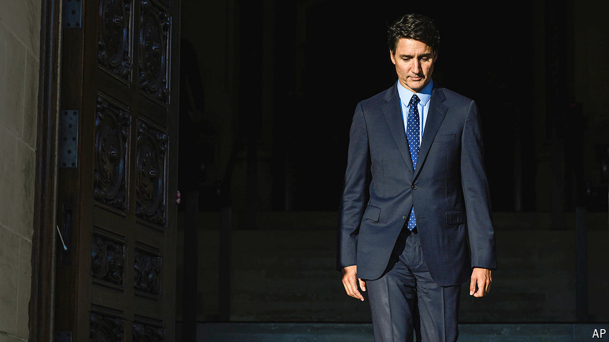

###### Canadian politics

# A by-election loss puts Justin Trudeau on the ropes 

##### For how much longer can the Liberal leader hold on? 

 

> Sep 19th 2024 

Add a political beast to Canada’s endangered species list: Justin Trudeau’s Liberal party. On September 16th the prime minister’s party lost a by-election in his hometown of Montreal, an area that it had represented almost uninterruptedly since the second world war. That was the second supposedly impregnable Liberal fortress to fall in just three months, following the loss of a seat in Toronto in June. The message is unmistakable. Voters are horribly disenchanted with Mr Trudeau and the Liberals. The consequence is less clear: whether Mr Trudeau will resign. 

