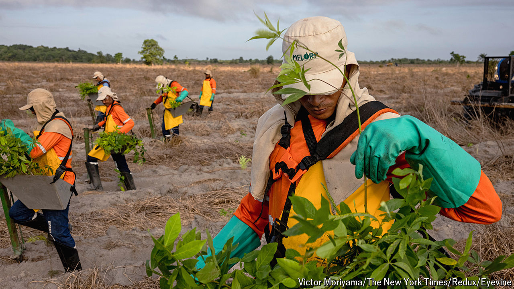

###### Rainforest rewards

# Can the voluntary carbon market save the Amazon? 

##### Entrepreneurs in Brazil are betting big on planting trees 

 

> Sep 19th 2024 

A tractor with a subsoiler loosens the earth and carves out deep holes. A dozen men follow, dropping tree seedlings into them. This industrious scene in a deforested part of the Amazon is more reminiscent of the paper-and-pulp industry than the voluntary carbon market, in which companies buy carbon credits to offset their greenhouse-gas emissions. Brazil can be to carbon removal what Saudi Arabia was to carbon production, claims Peter Fernandez of Mombak, the company that runs the project. “And I want Mombak to be the Saudi Aramco of that,” he says.

