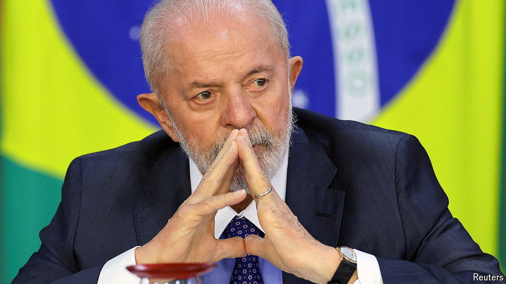

###### Who’s in charge?

# How Brazilian lawmakers won extra powers to waste money 

##### Congress’s capture of the budget is making Brazil less governable 

 

> Sep 19th 2024 

President Luiz Inácio Lula da Silva is exasperated. “In no other country in the world has Congress kidnapped part of the budget” as has happened in Brazil, he fumed in August. He has a point. In the past decade Brazil’s Congress has become one of the most powerful in the world by giving itself ever greater control of the country’s federal budget. The Supreme Court and Lula, as the president is universally known, are trying to curb legislators’ extravaganza of pork-barrel spending, which fosters corruption and imperils the country’s fiscal targets. In response, Congress is threatening a power grab. 

