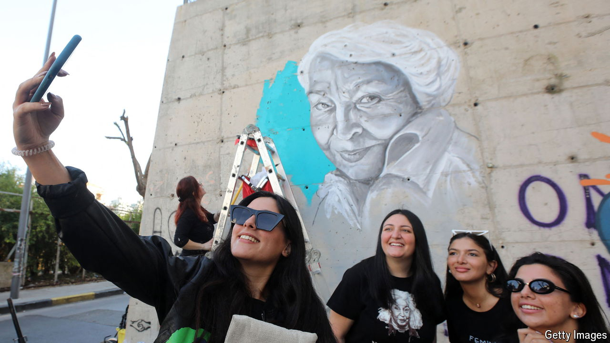

###### The Economist reads

# What to read about modern feminism 

##### An introduction to a large, evolving and controversial subject 

 

> Sep 19th 2024 

FEMINISTS HAVE a basic belief: that men and women are in all important respects equal. But getting people, especially men, to accept that truth and act on it has been the work of centuries. Feminists have made the case through activism, politics, economics, journalism and art. The work is unfinished. Western feminist theory has divided the movement’s history, and writing about it, into “waves”. In this interpretation feminism began in the late 1840s with the campaign for women’s suffrage in America. The second wave came in the 1960s with the call for women’s “liberation” and equality under the law. A third wave in the 1990s was more rebellious than reformist, more anarchically individualistic than disciplined and legalistic. Some think we are in the midst of a fourth wave, sustained by the internet and social media; the  movement, which calls out sexual misconduct by powerful men, is its characteristic expression. 

