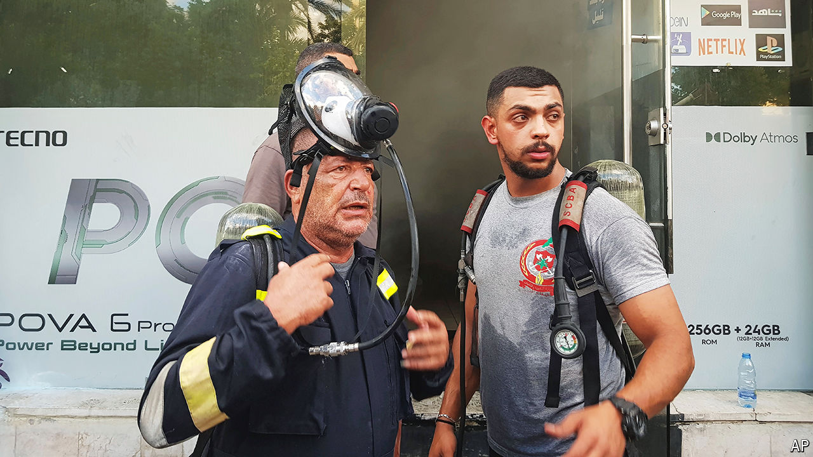

###### The world this week

# Politics 

#####  

 

> Sep 19th 2024 

At least 12 people were killed, including two children, and 2,800 injured when  used by members of , an Iranian-backed militia, exploded in Lebanon and Syria. The next day  blew up across Lebanon, killing another 20 people and injuring 450.  is assumed to be behind the attacks. It is thought that Israeli agents planted explosive substances inside the devices before they were imported into Lebanon. Israel had just expanded its war aims to include the safe return of 60,000 evacuees, displaced by Hizbullah rockets, to the country&#39;s north. 

