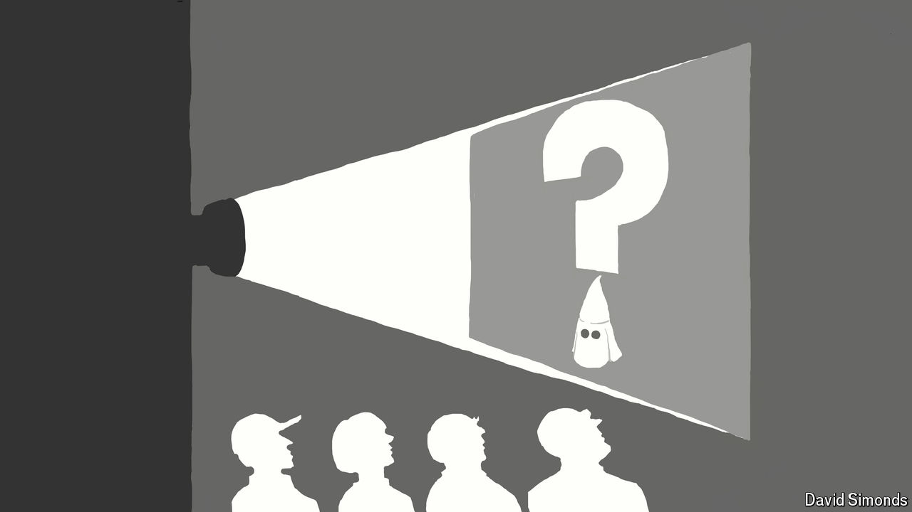

###### Lexington

# How the right is taking culture war to culture itself 

##### A new “mockumentary” satirises anti-racist activism 

 

> Sep 19th 2024 

The woman has a confession to make. Over an elegant dinner, she admits to her companions that sometimes when she is out with her husband and he is “really loud” she shushes him. A normal exchange within a marriage, one might think. But she is white and he is black. Her impulse, she worries, is “probably my white supremacy talking”. 

