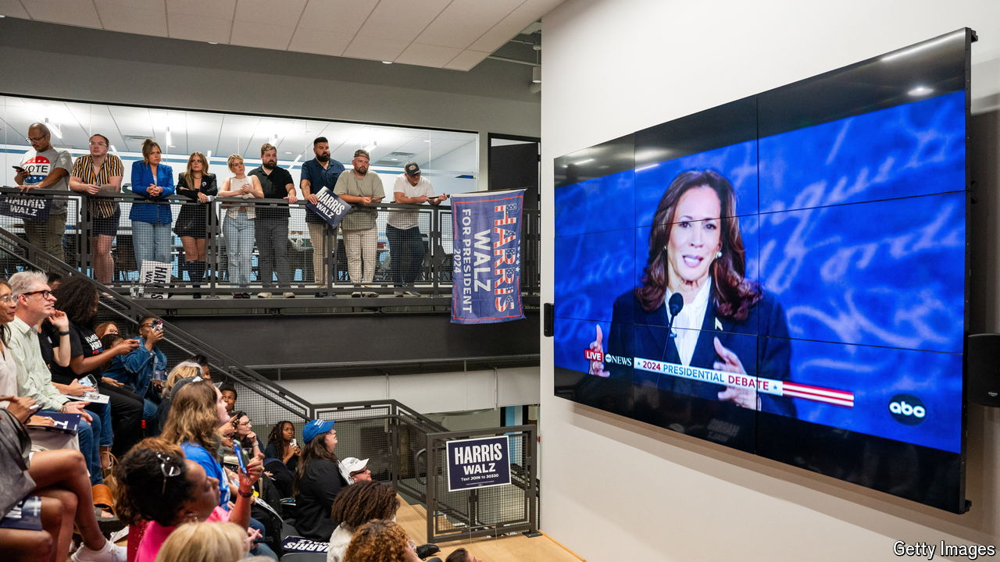

###### Campaign calculus: now you see it

# Kamala Harris’s post-debate bounce is now visible in the polls 

##### But it comes with two big caveats 

 

> Sep 18th 2024 

LIKE BIRD-WATCHERS with binoculars, observers of America’s presidential race have had their eyes trained on the opinion polls to see whether they can spot a post-debate bounce for either candidate. Now they can. According to , Kamala Harris’s nationwide lead over Donald Trump has widened to 4.5 percentage points, from 3.8 points on September 10th, the day of their debate. A 0.7-point improvement is small but potentially significant, and gives Ms Harris her biggest lead yet in our tracker (see chart). 

