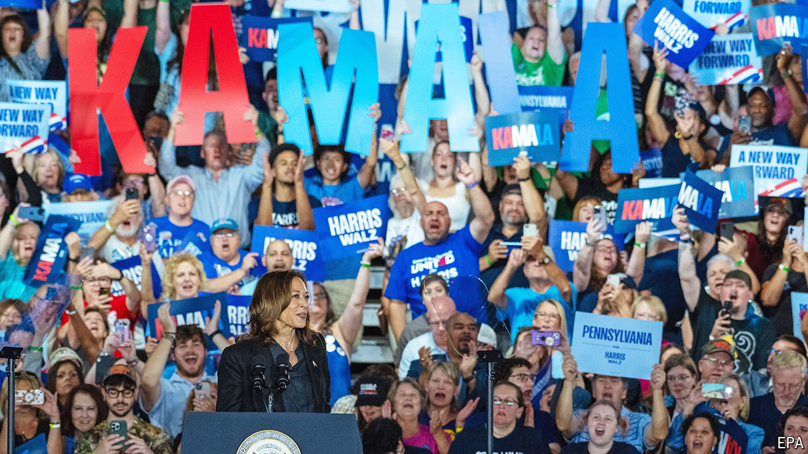

###### Swing states

# Pennsylvania, the crucial battleground in America’s election 

##### Buckets of money, vicious advertising and consultants galore have left the race for the state a virtual tie 

 

> Sep 19th 2024 

ON JULY 21st Matt Roan, chair of the Cumberland County Democratic Committee, hosted a meeting with volunteers. The event took a turn when Mr Roan stopped to read a statement from Joe Biden announcing his departure from the presidential race. “There was this sort of sense of sadness—and then immediate hope,” Mr Roan recalls in his office, which overlooks the Pennsylvania state capitol. The activist speaks highly of Mr Biden but acknowledged that “things were not looking good” at the time. The rise of Kamala Harris attracted a surge of volunteers to a county that favoured Donald Trump by around 18 points in 2016 but only 11 points in 2020. If such improvements hold there and in other areas like it, Ms Harris would probably win the state and the presidency. 

