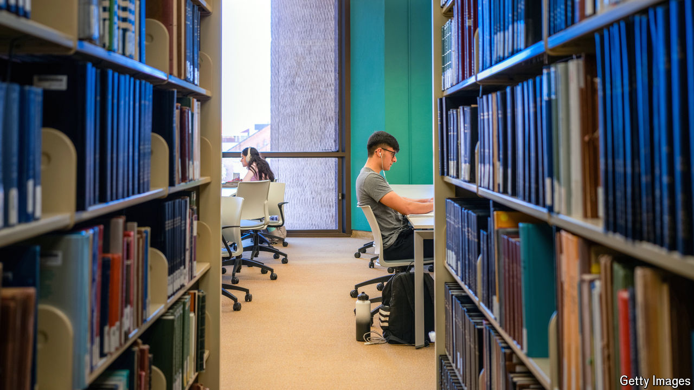

###### Admit it

# What has been the effect of the Supreme Court’s ban on affirmative action? 

##### Making sense of the drip-drip of admissions data from American universities 

 

> Sep 19th 2024 

In June 2023 the Supreme Court banned race-conscious admissions at American universities. Many supporters of the practice feared that black and Hispanic enrolment at the nation’s most selective colleges would plunge, too, when members of the class of 2028 arrived on campus.

