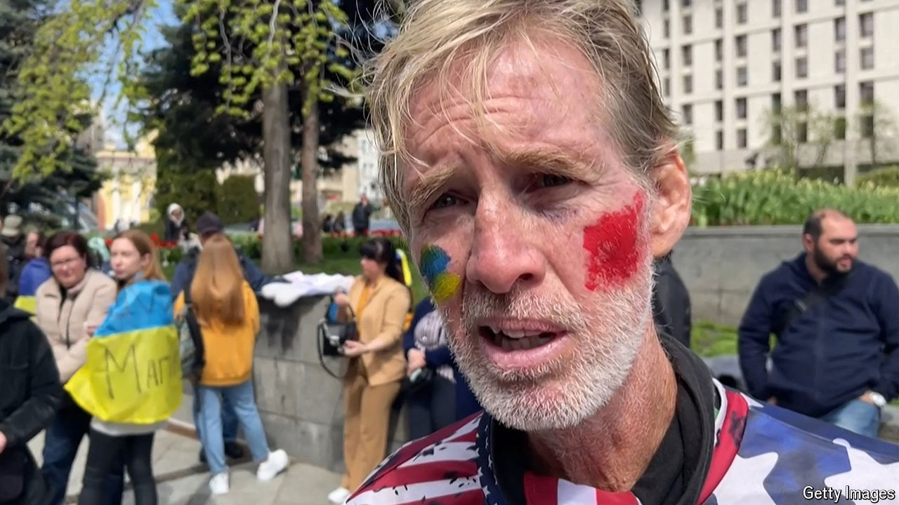

###### The man behind the gun

# Who is Ryan Routh, Donald Trump’s would-be assassin? 

##### His 291-page screed on Ukraine’s “unwinnable war” offers some clues 

 

> Sep 17th 2024 

RYAN WESLEY ROUTH was prepared for a stakeout. The lanky 58-year-old from Hawaii waited behind the fence of Donald Trump’s golf course in West Palm Beach, Florida, for 12 hours, according to mobile-phone records. He had packed a bag of food, a camera, a semi-automatic rifle and a scope. A Secret Service agent spotted Mr Routh’s gun and opened fire before he could  the former president, who was playing an unscheduled round.  says Mr Routh did not have sight of Mr Trump, but the apparent assassination attempt was the second in just over two months. 

