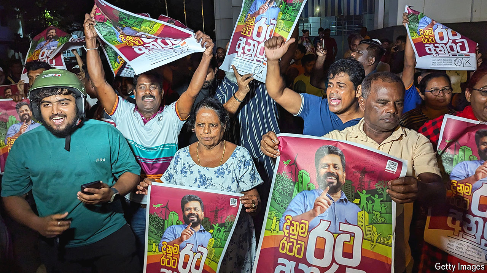

###### All change

# An upset in Sri Lanka propels an outsider into power 

##### The new president leads a party with Marxist roots 

 

> Sep 23rd 2024 

TWO YEARS have passed since Sri Lanka—crippled by covid-19, excessive borrowing and a series of policy blunders—defaulted on its debts. Inflation soared, the rupee plunged in value and fuel supplies ran out.  the China-friendly president, Gotabaya Rajapaksa, who promptly fled to the Maldives. Things are no longer . Leaders have tamed inflation, secured a bail-out from the IMF and reached agreement with the country’s creditors on restructuring its debts.

