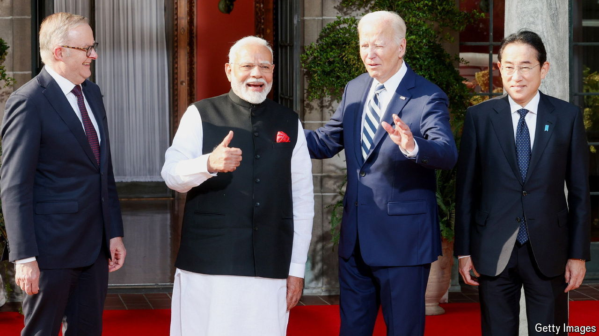

###### Going soft

# Has the Quad lost its way? 

##### Critics say the loose coalition is lowering its ambitions 

 

> Sep 26th 2024 

The idea was that grand government buildings in Delhi would host this year’s meeting of the “Quad”—a coalition comprising America, Australia, India, and Japan. That was before prosecutors in New York uncovered an attempt to assassinate an American activist of Sikh heritage, allegedly at the direction of Indian intelligence officers. Joe Biden decided against visiting India (though his staff blamed scheduling challenges, not diplomatic worries, for that call). Instead, on September 21st, America’s president hosted the leaders of the Quad countries at a suburban school in his home state of Delaware. 

