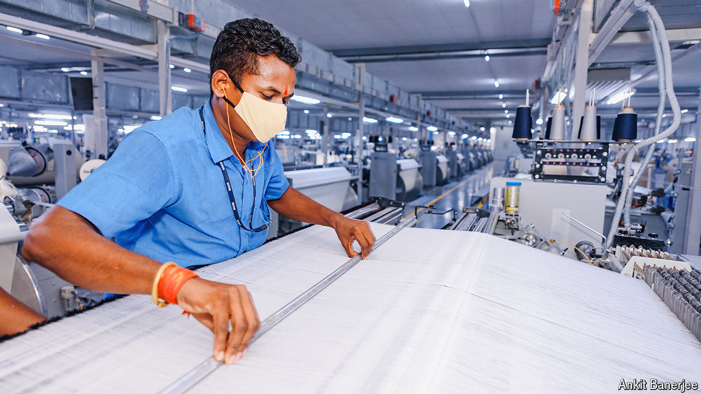

###### Tailored solutions

# How India can compete in labour-intensive manufacturing 

##### Lessons from a superstar exporter 

 

> Sep 26th 2024 

HARISH AHUJA is the chairman of Shahi Exports, India’s biggest exporter of clothes. Two things about his business surprise. With some 50 factories and $1bn in annual revenues, Shahi is managing to expand even as most peers in its sector struggle. It is also short of workers, says Mr Ahuja—at a time when many young Indians complain that their country offers too few jobs.

