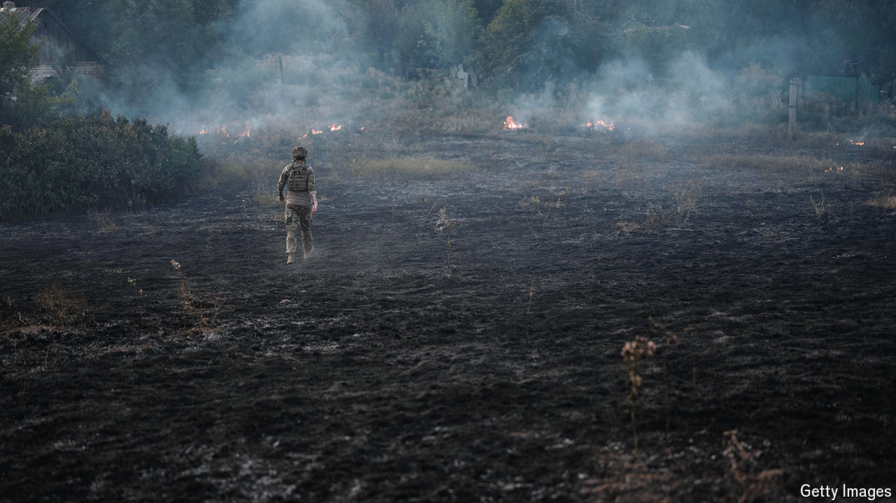

###### A widening breach

# Ukraine is on the defensive, militarily, economically and diplomatically 

##### Russian advances, fatigue among its allies and political divisions at home leave it in a bind 

 

> Sep 26th 2024 

“Russia CAN only be forced into peace,” Volodymyr Zelensky, the president of Ukraine, told the UN Security Council this week. Mr Zelensky has been touring America, glad-handing the great and the good and talking up his “victory plan” to end two and a half years of war with Russia. As usual, he asked for more military, financial and diplomatic support to help face down Russia’s relentless attacks. President Joe Biden obliged, announcing a new consignment of weapons for Ukraine. But Donald Trump, the Republican candidate to replace him, is much less amenable. Mr Zelensky clearly worries that Ukraine, not Russia, may be forced into an unpalatable peace. With his army gradually losing ground, his people’s enthusiasm for the war flagging and Western support in doubt, Mr Zelensky is in a bind. 

