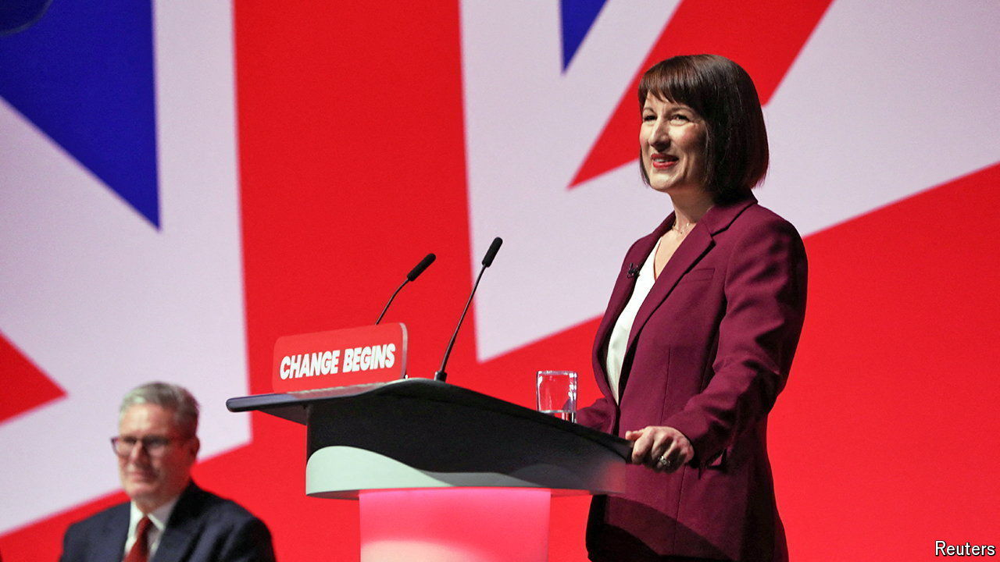

###### Loosening the chains

# Britain’s budget choices are not as bad as the government says 

##### It has more room for manoeuvre than it lets on 

 

> Sep 24th 2024 

The mood music from Britain’s new government about its first budget has been a funeral dirge. “There’s a budget coming in October and it’s going to be painful,” Sir Keir Starmer, the prime minister, warned in August. “The road ahead is steeper and harder than we expected,” said Rachel Reeves, the chancellor, at the Labour Party’s conference on September 23rd. A day later Sir Keir invoked “the iron law of properly funding policies”.

