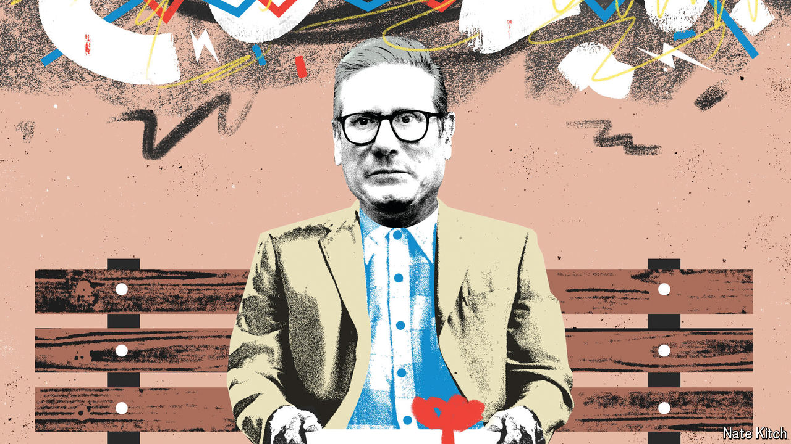

###### Bagehot

# Inside the chaos machine of British politics 

##### The Labour Party promises calm. But the world it inhabits is built for chaos 

 

> Sep 25th 2024 

Politicians often promise what they cannot achieve. Usually it is the prospect of national glory or prosperity without pain. But even the most prosaic pledge can sometimes fail. Sir Keir Starmer, the prime minister, entered office with an offer to bring “calm” to a country fed up after a decade of political ructions. , it is not in his gift. British politics is built for chaos. 

