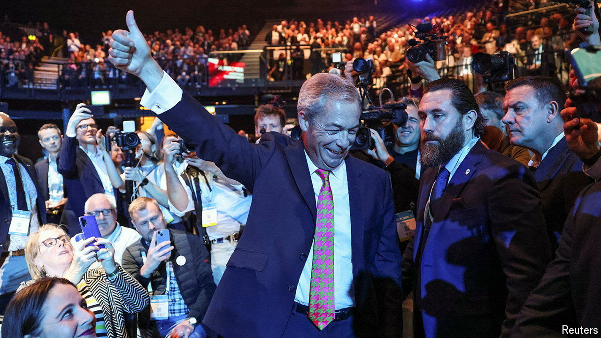

###### The right reaction

# Much keener on Trump, less sure about Charles III 

##### The differences between Reform UK voters and Tory supporters 

 

> Sep 20th 2024 

In 2023 the delegates at Reform UK’s annual party conference just about filled a smallish room at a hotel in London. This year’s conference, which opened on September 20th, is taking place in a cavernous hall in Birmingham’s National Exhibition Centre. Under the leadership of Richard Tice, the party routinely  to keep its deposit in parliamentary by-elections. This year, under the leadership of Nigel Farage, Reform UK garnered more than 4m votes in the general election and returned five MPs to Parliament, Messrs Tice and Farage among them. 

