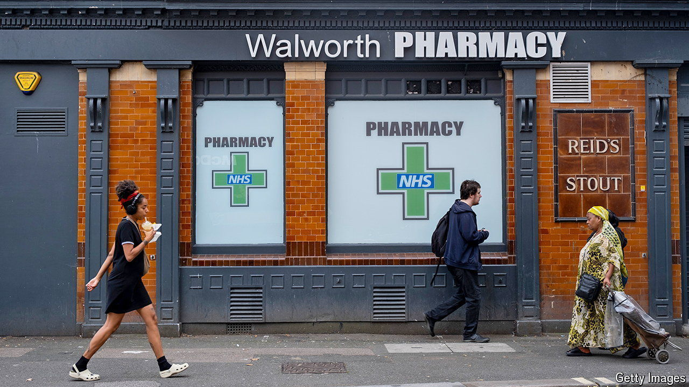

###### A healthy balance-sheet

# Should Britons’ health be considered a national asset? 

##### Persuading the Treasury that sickness is anti-growth 

 

> Sep 26th 2024 

WES STREETING, the health secretary, likes to make a snappy prediction. If health spending keeps going up, he says, then Britain will end up like “the National Health Service with a little country attached to it”. It does not have to be this way, a number of think-tanks close to Labour insist. Instead of viewing health as a cost, they argue, Britain should think of it as an asset. The idea of investing in better health fits snugly with Mr Streeting’s plans to shift the focus of the NHS from hospitals to community care, from sickness to prevention. But it could also act as a supplement to boost Britain’s growth.

