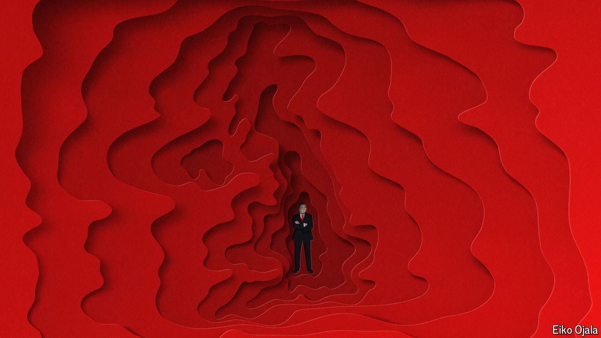

###### Sir Unclear Starmer

# What is Britain’s Labour government for? 

##### A bumpy transition from opposition to office 

 

> Sep 25th 2024 

IN a hot basement room in Liverpool, Pat McFadden, the chancellor of the Duchy of Lancaster and the prime minister’s most trusted fixer, was regaling delegates at the Labour Party’s annual conference with stories of how the landslide victory in July had been won. As the campaign co-ordinator, Mr McFadden had spent days on end with Morgan McSweeney, another aide, plotting the destruction of the  in a tiny windowless office they termed “the cell”. It was when pizza was passed through the door that they realised they really were prisoners, he joked. 

