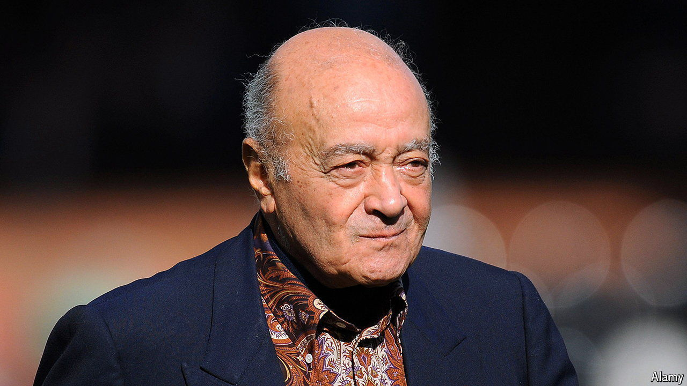

###### The gravest questions

# Why did Mohamed Al Fayed escape scrutiny? 

##### Allegations of company-enabled sexual abuse raise big questions 

 

> Sep 26th 2024 

“THis MAN was a litigious billionaire,” explained Nicole, who worked in the 2000s as a secretary at Harrods, a high-end department store in London that was then owned by Mohamed Al Fayed. “He still felt like a threat until the moment he died,” said Jen, another former employee. Nicole and Jen are among 37 women who have said that they were sexually assaulted by Al Fayed between the 1980s and 2000s. Five say he raped them. 

