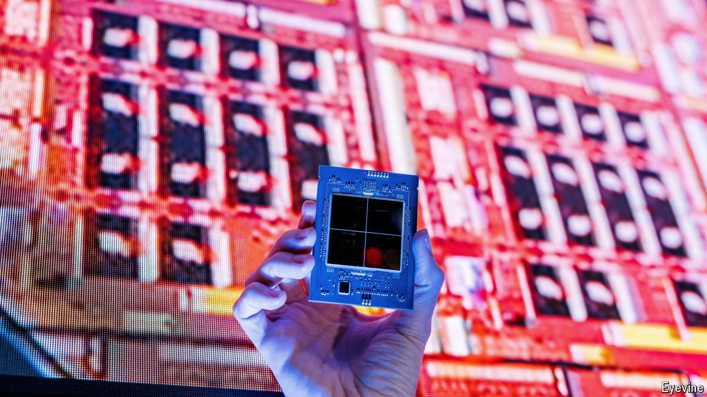

###### Silicon sally

# Can dealmaking save Intel? 

##### America’s failing chip champion needs a financial-engineering miracle 

 

> Sep 25th 2024 

Intel has spent two decades missing the next big thing. The chipmaker’s dominant PC business blinded it to the opportunity from mobile phones in the 2000s. More recently, the firm was slow to adopt extreme-ultraviolet lithography, an expensive chipmaking process that was originally funded by Intel itself. Now Nvidia dominates the white-hot market for designing artificial-intelligence (AI) chips, becoming the world’s most valuable semiconductor company. Investors in Intel have voted with their feet (see chart).

