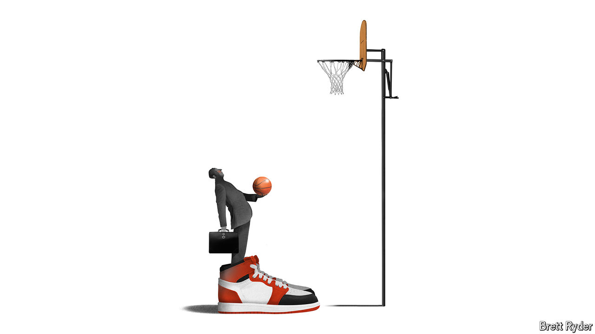

###### Schumpeter

# Is a Nike lifer the best person to revive the swoosh? 

##### Insider CEOs come with less risk—but fewer potential rewards 

 

> Sep 26th 2024 

THE 2015-16 season was an epic one for Nike’s athletes. LeBron James led the Cleveland Cavaliers to basketball glory in the NBA play-offs and the Denver Broncos, quarterbacked by the Nike-shod Peyton Manning, triumphed in American football’s 50th Super Bowl. In proper football, Cristiano Ronaldo won both the UEFA Champions League (with Real Madrid) and the European championship (with Portugal). In tennis, Serena Williams secured her seventh Wimbledon singles title. At the Olympic games in Rio de Janeiro, 89 track-and-field medallists plus the entire male marathon podium wore Nikes, and Simone Biles, who had clinched an endorsement deal with the sportswear giant the year before, tumbled her way to four gymnastics golds and a bronze. 

