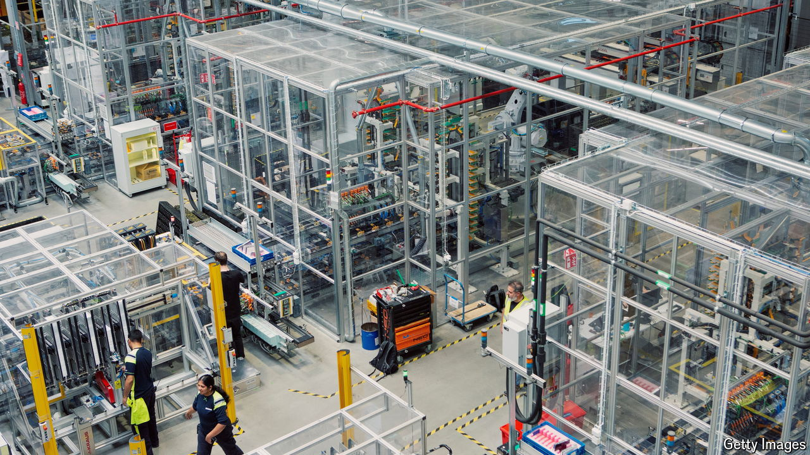

###### Electric shock

# Northvolt announces more cuts, worrying investors 

##### Europe’s battery-making champion has overstretched itself 

 

> Sep 26th 2024 

Northvolt had all the trappings of an industrial champion. Capital had poured in from Wall Street titans such as Goldman Sachs and BlackRock. Assorted governments had blessed its plans with generous grants and big customers had vouched for its technology. But on September 23rd the seven-year-old Swedish battery-maker announced that it would suspend work on one of its new manufacturing plants, slow the expansion of its research and development (R&amp;D) unit and lay off a fifth of its workforce. It was the second round of cutbacks in a month. 

