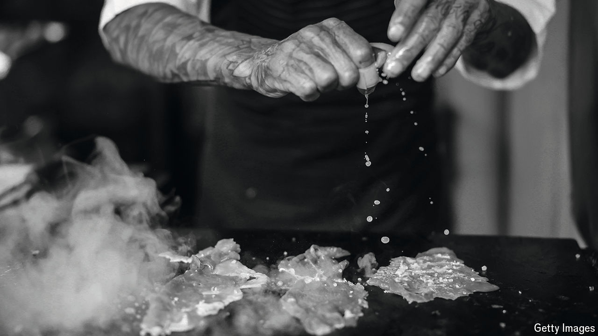

###### Star-crossed

# The curse of the Michelin star 

##### Restaurants awarded the honour are more likely to close, research finds 

 

> Sep 24th 2024 

The twelve new restaurants added to the New York Michelin Guide this month, serving up cuisine ranging from “haute French” to “eco-chic”, will be toasting their success. Being featured in the handbook of the tyre-maker-turned-restaurant-critic is the first step towards receiving a Michelin star, the most coveted award in fine dining. Yet according to research recently published in the , an improbable source of culinary intelligence, restaurants might be better off remaining starless.

