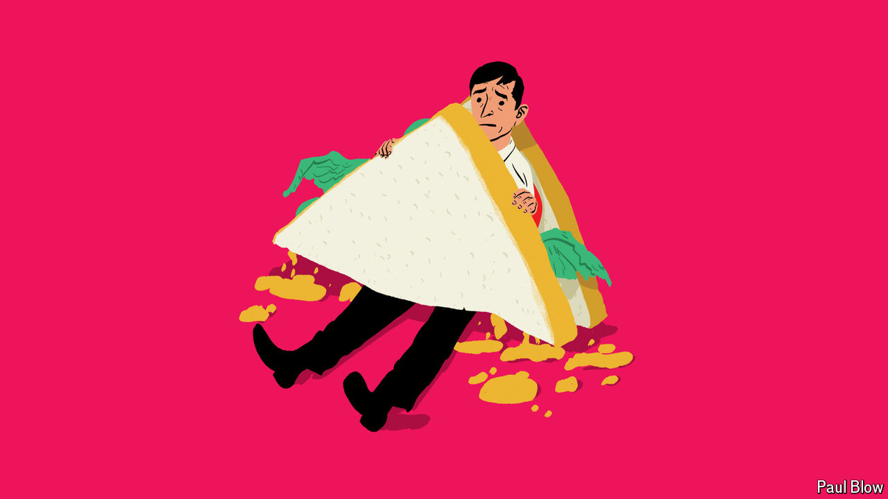

###### Bartleby

# The hell of the sandwich lunch 

##### Working and eating do not go together 

 

> Sep 26th 2024 

The competition to be the worst two words in the English language is extremely hard-fought. Surprise party. Cruise holiday. Rice pudding. Keen golfer. The list goes on and on. But right up there is “sandwich lunch”. Separately, each of these words contains lots of promise. In combination they spell unmitigated disaster.

