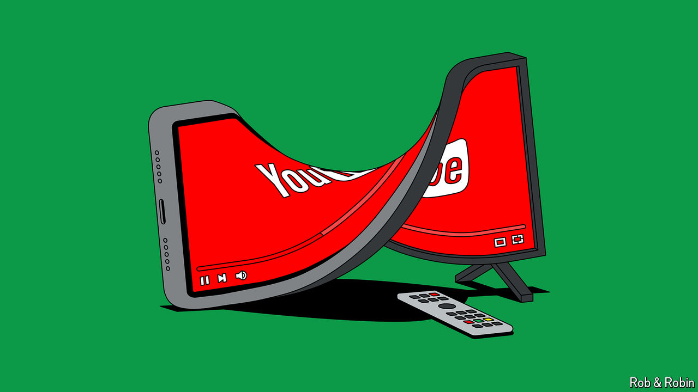

###### Old v new media

# YouTubers like MrBeast are coming for Hollywood 

##### Scandals will not be enough to stop a new generation from taking over 

 

> Sep 22nd 2024 

FIVE MILLION DOLLARS were on offer to contestants in “Beast Games”, a new game show being made for  streaming service. Instead, some participants received physical injuries, emotional distress and sexual harassment, according to a complaint filed in a Los Angeles court on September 16th. Amazon and the show’s creator, Jimmy Donaldson, a 26-year-old YouTuber known as , have not commented on the lawsuit. But the fiasco has reassured some Hollywood executives that they have little to fear from social-media upstarts.

