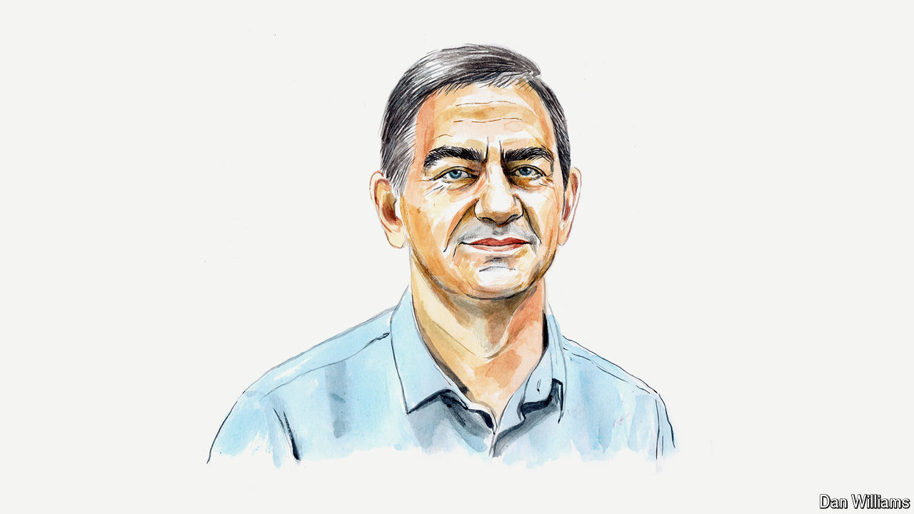

###### COP29

# COP29 is greenwashing a dictatorship, writes Azerbaijan’s main opposition leader 

##### Ali Karimli on the hypocrisy of holding the climate conference in a petrostate where dissent is silenced 

 

> Sep 26th 2024 

BAKU IS GEARING up to host COP29 in November, an event being prioritised by Ilham Aliyev, Azerbaijan’s authoritarian leader—not due to environmental concerns, but for image management. Over 90% of Azerbaijan’s exports are oil and gas, and its economy remains undiversified. The country’s serious environmental issues have never been a priority for the regime.

