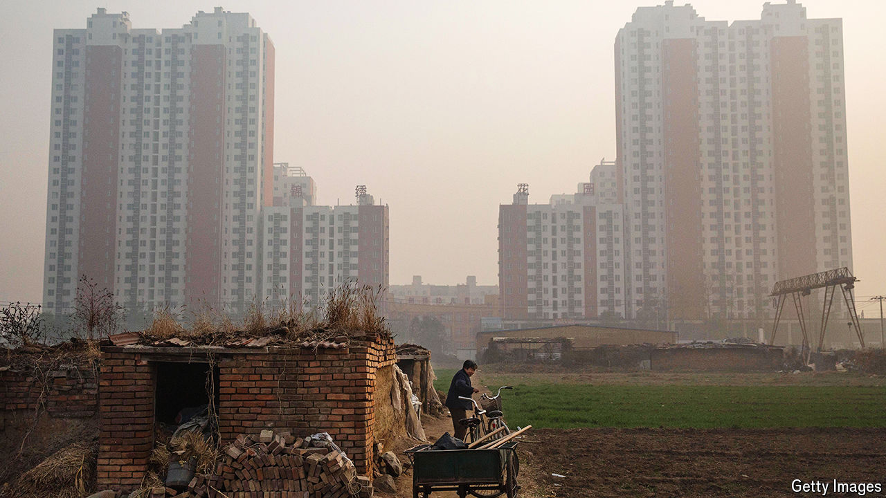

###### Looking up in frustration

# A new class struggle is brewing in China 

##### As the economy falters, resentment between social groups is growing 

 

> Sep 23rd 2024 

THE TERM “three generations in tobacco” has become a common shorthand in China. On social media it means a privileged elite whose members hand out coveted jobs (such as managerial roles in the state’s tobacco monopoly) to their own types. Earlier this year a microblogger with more than 850,000 followers invoked the meme. “The result of this hereditary system is a closed circle of power that completely cuts off opportunities for people at the bottom to rise up!” he wrote. Hundreds expressed agreement. “The ruling class is solidifying,” one replied. Another fumed: “The children of the elite get ahead, and the children of the poor remain poor.”

