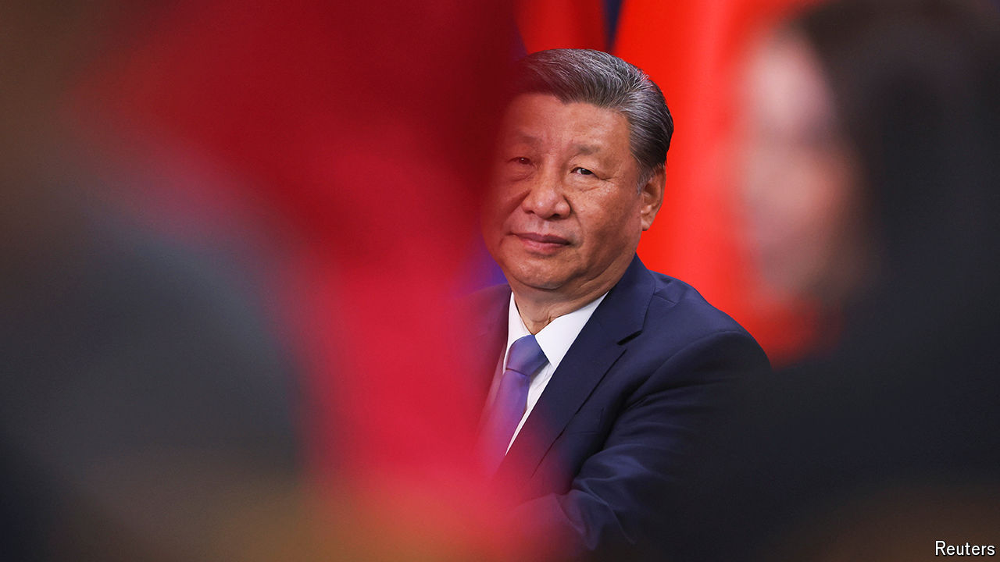

###### Brains-trust blues

# Xi Jinping wants to stifle thinking at a top Chinese think-tank 

##### No more gloomy thoughts about the economy 

 

> Sep 26th 2024 

The Chinese Academy of Social Sciences (CASS) is no ordinary collection of policy wonks. In China’s political hierarchy it has the status of a government ministry. It has thousands of staff, some of whom give briefings to the ruling Politburo. Among “think-tanks with Chinese characteristics” that China’s leader, Xi Jinping, says he wants to foster, it stands at the apex. But proximity to power offers no protection to its researchers. Mr Xi’s henchmen are turning up the heat on those who dare to think independently. 

